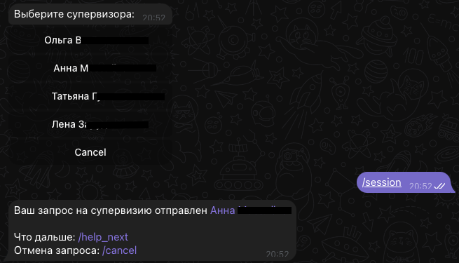

# Telegram Bot for Coaching Academy

Welcome to the **Coaching Academy Telegram Bot**! This [bot](https://t.me/casupvbot) simplifies planning and registration for supervision calls with mentors. It enables clients to schedule calls, communicate with mentors, and access help information seamlessly.

---

## Table of Contents

1. [Features](#features)
2. [Getting Started](#getting-started)
3. [Setup](#setup)
4. [Usage](#usage)
5. [Contributing](#contributing)
6. [License](#license)

---

## Features

- **Mentor Selection**: Clients can choose from 4 available mentors.
- **Scheduling**: Schedule a call with ease through the bot.
- **Automated Communication**: The bot handles all client communications.
- **Help Information**: Provides clear instructions for usage and assistance.
- **User-Friendly**: Simple and intuitive interaction flow.



---

## Getting Started

To get the bot up and running, follow these steps:

1. Clone the repository:
   ```bash
   git clone https://https://github.com/kzarms/bot_sv.git
   ```

2. Navigate to the project directory:
   ```bash
   cd bot_cv
   ```

3. Install the required dependencies:
   ```bash
   ./scripts/install.sh
   ```

4. To test the bot basic functions run testing:
   ```bash
   ./scripts/test.sh
   ```

5. Set up your Telegram Bot token (see [Setup](#setup)).

---

## Setup

1. Create a Telegram bot using the [BotFather](https://core.telegram.org/bots#botfather).
   - Follow the instructions to obtain your bot token.

2. Create a `token.txt` file in the project directory store the token inside:
   ```env
   2052123456:AAXXXX
   ```

3. Customize the mentors in the configuration file (`./db/supervisors.json`). Example:
   ```json
   {
       "000000000000": {
            "FullName": "Mentor Name",
            "Sessions": 0,
            "Requests": [],
            "Total": 0
        },
   }
   ```

   `000000000000` is a telegram bot user ID

4. Run the bot options:

    If you need to run the bot in the debug mode, declare the ENV variable and run the bot:
    ```bash
    export DEBUG="1"
    python ./src/bot.py
    ```

    If you need to start the bot as a service, use nohup tool
    ```bash
    source .venv/bin/activate && nohup python ./src/bot.py &
    ```
    To stop the serive and bot execution run following command:
    ```bash
    kill $(ps aux | grep 'python ./src/bot.py' | awk '{print $2}')
    ```

---

## Usage

### Client Commands

- **/start**: Start interacting with the bot.
- **/help**: Get instructions on how to use the bot.
- **/session**: Schedule a call with a mentor.
- **/cancel**: Cancel a scheduled session.

### Mentor Commands

- **/reg**: Request to register a new mentor.
- **/review**: View your upcoming requests.
- **/stat**: Personal statistic for mentor.
- **/cancel**: Cancel a scheduled session.

---

## Contributing

Contributions are welcome! If you have ideas for improvements, feel free to fork the repository and submit a pull request.


## License

This project is licensed under the MIT License. See the [LICENSE](./LICENSE) file for details.

---

## Contact

For further inquiries or support, please contact:

- **Email**: ikotpad@gmail.com
- **Telegram**: [@knstp](https://t.me/knstp)
